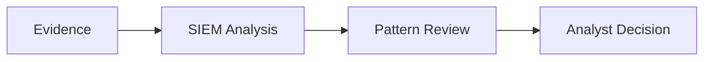

# Windows Authentication Triage in SIEM

> SOC-style investigation of Windows failed logons to determine whether activity is benign, suspicious, or escalation-worthy.

---

## Case Snapshot

| Category | Details |
|---|---|
| **Role Alignment** | SOC Analyst I · Junior Cybersecurity Analyst · IT Support · IAM Support |
| **Scenario** | Repeated Windows failed logons detected |
| **Main Question** | User error, account lockout, stale credentials, brute force, or password spraying? |
| **Tools** | Windows Event Logs · PowerShell · Splunk · SPL |
| **Primary Event ID** | 4625 — Failed Logon |
| **Supporting Event ID** | 4740 — Account Lockout |
| **Status** | Building |
| **Final Decision** | Pending evidence collection |

---

## Investigation Flow



---

## Skills Demonstrated

| Skill | How It Is Shown |
|---|---|
| **SIEM Analysis** | SPL searches for failed logons by user, source, and time |
| **Windows Log Analysis** | Event ID 4625 and 4740 review |
| **Authentication Triage** | User error vs lockout vs brute force vs password spraying |
| **PowerShell Evidence Collection** | `Get-WinEvent` validation and CSV export |
| **SOC Documentation** | Triage ticket, escalation note, final analyst decision |
| **Detection Thinking** | Basic detection logic and MITRE ATT&CK mapping |

---

## Key Evidence

| Evidence | Purpose | Status |
|---|---|---|
| Audit policy screenshot | Confirms failed logon auditing is enabled | Pending |
| Event ID 4625 validation | Confirms failed logons exist | Pending |
| CSV export | Preserves structured event data | Pending |
| Splunk ingestion screenshot | Confirms SIEM analysis setup | Pending |
| SPL search results | Shows investigation logic | Pending |
| Timeline / timechart | Shows activity pattern | Pending |
| SOC triage ticket | Shows ticket-ready documentation | Pending |
| Escalation note | Shows handoff readiness | Pending |

---

## Core SPL Searches

### Failed logons by account

```spl
index=windows_auth_lab EventID=4625
| stats count by TargetUserName
| sort - count
```

### Failed logons by source

```spl
index=windows_auth_lab EventID=4625
| stats count by SourceNetworkAddress
| sort - count
```

### Failed logon timeline

```spl
index=windows_auth_lab EventID=4625
| timechart span=5m count
```

---

## Analyst Decision Model

| Pattern | Likely Meaning | Action |
|---|---|---|
| Few failures, one user, same device | Mistyped password | Document / monitor |
| Many failures, one user | Lockout or brute-force attempt | Investigate |
| Many users, same source | Possible password spraying | Escalate |
| Failed logons followed by success | Possible compromise | High-priority review |
| Service account failures | Stale credentials | Escalate to IT / app owner |

---

## Repository Navigation

| Section | Purpose |
|---|---|
| [`case-summary.md`](./case-summary.md) | Short incident-style summary |
| [`artifacts-index.md`](./artifacts-index.md) | Index of evidence and outputs |
| [`evidence/`](./evidence/) | Screenshots, exports, and raw logs |
| [`investigation/`](./investigation/) | Timeline, findings, and analyst decision |
| [`queries-and-commands/`](./queries-and-commands/) | PowerShell commands, SPL searches, detection logic |
| [`tickets/`](./tickets/) | SOC triage ticket and escalation note |
| [`mappings/`](./mappings/) | MITRE ATT&CK mapping |
| [`remediation/`](./remediation/) | Recommended actions and monitoring ideas |

---

## Build Checklist

- ✅ Enable and verify Windows logon auditing
- [ ] Generate controlled failed logon events
- [ ] Validate Event ID 4625 with PowerShell
- [ ] Export authentication events to CSV
- [ ] Upload CSV into Splunk
- [ ] Run SPL searches
- [ ] Capture key screenshots
- [ ] Write analyst decision
- [ ] Complete SOC ticket and escalation note
- [ ] Add MITRE ATT&CK mapping

---

## Final Deliverable

A complete SOC-style case showing:

```text
Alert → Evidence → SIEM Search → Pattern Review → Analyst Decision → Response
```
