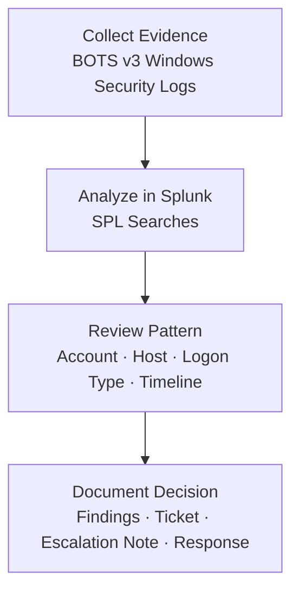

# Windows Authentication Triage in SIEM

> SOC-style authentication investigation using public BOTS v3 Windows Security logs to review failed logons and determine whether activity supports escalation.

---

## Case Snapshot

| Category | Details |
|---|---|
| **Role Alignment** | SOC Analyst I · Junior Cybersecurity Analyst · IT Support · IAM Support |
| **Scenario** | Windows failed-logon activity reviewed in Splunk |
| **Main Question** | Do the failed logons indicate user error, account lockout, brute force, password spraying, or escalation-worthy activity? |
| **Dataset** | Splunk BOTS v3 |
| **Index** | `botsv3` |
| **Sourcetype** | `WinEventLog:Security` |
| **Tools** | Splunk · SPL · Windows Security Logs |
| **Event IDs Reviewed** | `4624`, `4625`, `4740` |
| **Final Decision** | Low-volume failed logons reviewed; no brute-force, password-spray, or lockout pattern confirmed |

---

## Investigation Flow



---

## Key Evidence

| Evidence | Result | Status |
|---|---|---|
| Splunk index validation | BOTS v3 loaded successfully with `2,083,056` events | ✅ |
| Sourcetype validation | Windows Security logs found under `WinEventLog:Security` | ✅ |
| Authentication event summary | `427` successful logons and `3` failed logons identified | ✅ |
| Event ID 4625 review | Failed-logon events confirmed in Windows Security logs | ✅ |
| Account/host review | Failed logons observed on `SEPM` and `MKRAEUS-L` | ✅ |
| Timeline review | Activity was low-volume across two hourly buckets | ✅ |

---

## Evidence Screenshots

| Screenshot | Purpose |
|---|---|
| [`splunk-sourcetypes-loaded.png`](./evidence/screenshots/splunk-sourcetypes-loaded.png) | Shows available sourcetypes in BOTS v3 |
| [`authentication-eventcode-summary.png`](./evidence/screenshots/authentication-eventcode-summary.png) | Shows successful vs failed logon counts |
| [`event-4625-compact-table.png`](./evidence/screenshots/event-4625-compact-table.png) | Shows failed-logon evidence in a compact table |
| [`failed-logons-by-account-host.png`](./evidence/screenshots/failed-logons-by-account-host.png) | Summarizes failed logons by account, host, and logon type |
| [`failed-logon-timeline-column-chart.png`](./evidence/screenshots/failed-logon-timeline-column-chart.png) | Shows failed-logon timing pattern |

---

## Skills Demonstrated

| Skill | How It Is Shown |
|---|---|
| **SIEM Analysis** | Used Splunk to search and summarize Windows Security authentication events |
| **Windows Log Analysis** | Reviewed EventCode `4624`, `4625`, and `4740` |
| **Authentication Triage** | Compared failed logon volume, host context, logon type, and timeline |
| **SPL Querying** | Built searches for index validation, sourcetype review, event counts, and failed-logon summaries |
| **SOC Documentation** | Created findings, analyst decision, triage ticket, and escalation note |
| **Detection Thinking** | Documented escalation conditions and monitoring logic without overclaiming malicious activity |

---

## Analyst Decision Model

| Pattern | Likely Meaning | Action |
|---|---|---|
| Low-volume failed logons | Isolated authentication failures | Document and monitor |
| Many failures for one account | Possible brute force or lockout | Investigate |
| One source targeting many users | Possible password spraying | Escalate |
| Failed logons followed by success | Possible credential compromise | High-priority review |
| Service-style logon failures | Possible stale service credentials | Review service context |

---

## Final Analyst Decision

Low-volume failed-logon activity was observed in the reviewed BOTS v3 Windows Security logs.

The evidence did **not** confirm:

- High-volume brute-force behavior
- Password spraying
- Account lockout
- Large-scale multi-user targeting

The activity was documented as authentication triage with a recommendation to review involved hosts, logon types, and surrounding context if observed in a production SOC.

---

## Repository Navigation

| Section | Purpose |
|---|---|
| [`case-summary.md`](./case-summary.md) | Short incident-style summary |
| [`artifacts-index.md`](./artifacts-index.md) | Index of screenshots, outputs, and investigation files |
| [`evidence/`](./evidence/) | Screenshots, exports, and raw log artifacts |
| [`investigation/`](./investigation/) | Findings and analyst decision |
| [`queries-and-commands/`](./queries-and-commands/) | SPL searches and detection logic |
| [`tickets/`](./tickets/) | SOC triage ticket and escalation note |
| [`mappings/`](./mappings/) | MITRE ATT&CK mapping |
| [`remediation/`](./remediation/) | Recommended actions and monitoring ideas |

---

## Project Status

| Component | Status |
|---|---|
| Dataset loaded in Splunk | ✅ |
| Windows Security sourcetype identified | ✅ |
| Authentication EventCodes reviewed | ✅ |
| Failed-logon evidence captured | ✅ |
| Failed-logon timeline reviewed | ✅ |
| Findings documented | ✅ |
| Analyst decision documented | ✅ |
| SOC ticket completed | ✅ |
| Escalation note completed | ✅ |
| MITRE ATT&CK mapping completed | ✅ |
| Prevention and monitoring notes completed | ✅ |

---

## Final Deliverable

This project demonstrates a complete SOC-style authentication triage workflow:

```text
Dataset → SIEM Search → Evidence Review → Pattern Analysis → Analyst Decision → Response Documentation
```
